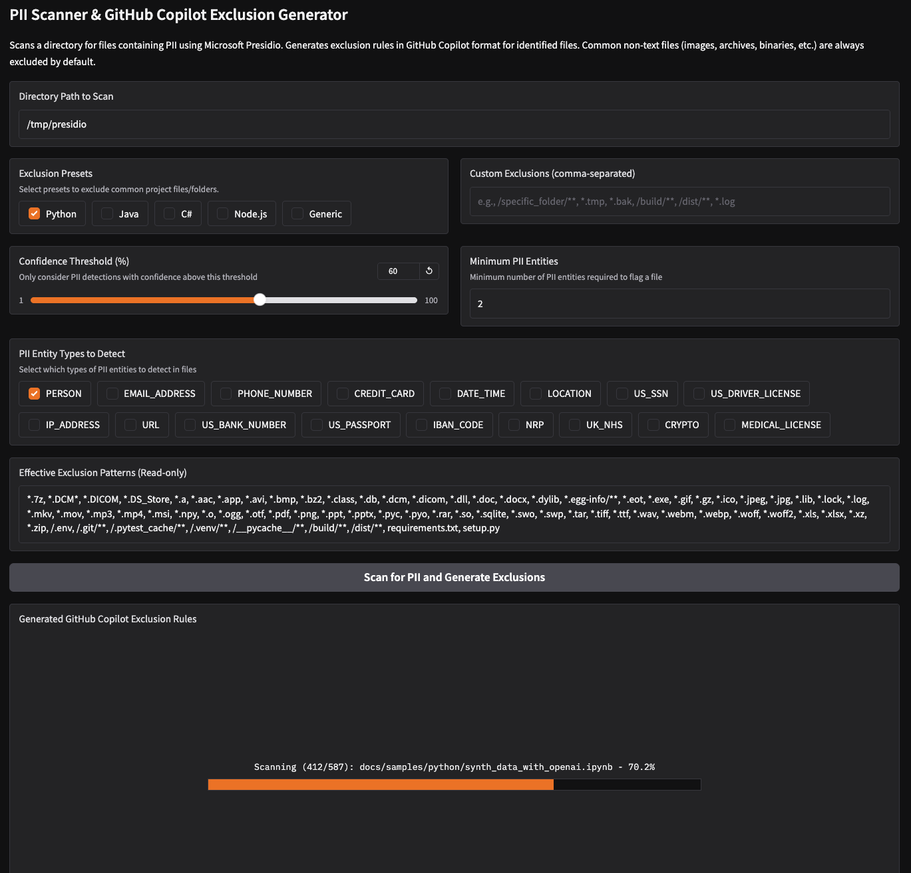

<div align="center">

# GitHub Copilot Exclusion Generator



**Protect your sensitive data by generating optimal GitHub Copilot exclusion rules**

[](https://github.com/aymenfurter/exclusion-generator/actions/workflows/ci.yml)
[](https://opensource.org/licenses/MIT)
[](https://www.python.org/downloads/)

</div>

## 📋 Overview

The GitHub Copilot Exclusion Generator helps you protect sensitive information in your repositories by automatically identifying files that might contain PII (Personally Identifiable Information) and generating appropriate exclusion rules for GitHub Copilot.

> ⚠️ **Important Note:** This tool is intended as a quality assurance step or temporary fix. PII and sensitive data should **not** be committed to repositories as-is. Always follow proper data governance practices by removing, encrypting, or using appropriate methods like environment variables for sensitive information before committing code.

### Key Benefits

- ✅ **Protect Privacy** - Prevent potential PII from beeing transmitted outside your organization
- ✅ **Save Time** - Automatically scan repositories instead of manual review
- ✅ **Customizable** - Tailor detection sensitivity and exclusion patterns to your needs
- ✅ **Smart Defaults** - Language-specific presets for common exclusion patterns

## 🚀 Quick Start

```bash
# Clone and install
git clone https://github.com/aymenfurter/exclusion-generator.git
cd exclusion-generator
pip install -r requirements.txt

# Run the app
python app.py

# Access via browser at http://localhost:7860
```


## ⚙️ Configuration Options

### PII Detection Settings

- **Confidence Threshold**: Minimum confidence level (%) required for PII detection
- **Minimum PII Entities**: Number of PII items needed to flag a file
- **PII Entity Types**: Customize which types to scan for:
  - PERSON
  - EMAIL_ADDRESS
  - PHONE_NUMBER
  - USERNAME
  - PASSWORD
  - and more...

### Exclusion Options

- **Preset Exclusions**: Language-specific presets (Python, JavaScript, etc.)
- **Custom Exclusions**: Add your own patterns as comma-separated values

## 🔍 How It Works

1. The tool scans your repository for text files
2. Each file is analyzed using NLP techniques to detect potential PII
3. Files are flagged based on your configured sensitivity settings
4. The tool generates GitHub Copilot exclusion rules based on detection results
5. Additional exclusions are added based on your selected presets
